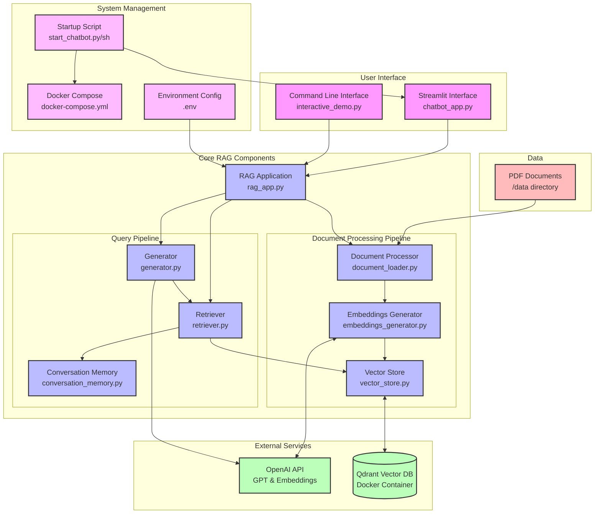

# Basic RAG System Architecture Diagram

## Component Details

### User Interface
- **Streamlit Interface (chatbot_app.py)**: Web-based chatbot UI that provides a user-friendly interface for interacting with the RAG system
- **Command Line Interface (interactive_demo.py)**: Terminal-based interface for testing and development

### Core RAG Components
- **RAG Application (rag_app.py)**: Main application that coordinates the document processing and query pipelines

#### Document Processing Pipeline
- **Document Processor (document_loader.py)**: 
  - Handles PDF document loading
  - Extracts text and metadata (e.g., year, financial information)
  - Uses RecursiveCharacterTextSplitter to chunk text intelligently
  - Configurable chunk size and overlap

- **Embeddings Generator (embeddings_generator.py)**:
  - Converts text chunks to vector embeddings
  - Uses OpenAI's text-embedding-ada-002 model
  - Processes documents in batches for efficiency

- **Vector Store (vector_store.py)**:
  - Manages storage of document embeddings and metadata
  - Interfaces with Qdrant vector database
  - Handles collection creation and management
  - Supports batch operations for document ingestion

#### Query Pipeline
- **Retriever (retriever.py)**:
  - Performs semantic search on vector database
  - Supports metadata filtering (year, document type)
  - Retrieves most relevant document chunks
  - Configurable number of retrieved documents (k parameter)

- **Generator (generator.py)**:
  - Uses OpenAI's GPT models to generate responses
  - Constructs prompts with retrieved document context
  - Handles different query types (general queries, financial summaries)
  - Maintains source attribution for transparency

- **Conversation Memory (conversation_memory.py)**:
  - Stores conversation history
  - Provides context for follow-up questions
  - Manages memory buffer size to optimize token usage

### External Services
- **OpenAI API**:
  - Provides embedding model (text-embedding-ada-002)
  - Provides GPT models for text generation
  - API key stored in environment variables

- **Qdrant Vector Database**:
  - Stores and indexes document embeddings
  - Runs in Docker container for easy deployment
  - Supports similarity search with filters
  - Persistent storage using Docker volumes

### Data
- **PDF Documents**:
  - Source documents stored in /data directory
  - Technical manuals and financial reports
  - Used for knowledge base creation

### System Management
- **Startup Scripts**:
  - Automates system initialization process
  - Checks Docker and Qdrant status
  - Launches Streamlit interface
  - Ensures proper environment setup

- **Docker Compose**:
  - Configures Qdrant container
  - Sets up volume mapping for data persistence
  - Defines network ports

- **Environment Configuration**:
  - Stores API keys and system parameters
  - Configurable chunk size and overlap parameters
  - Vector database connection settings

## Data Flow

1. **Document Ingestion Flow**:
   - PDFs → Document Processor → Text Chunks with Metadata
   - Text Chunks → Embeddings Generator → Vector Embeddings
   - Vector Embeddings → Vector Store → Qdrant Database

2. **Query Processing Flow**:
   - User Query → RAG Application
   - Query → Embeddings Generator → Query Vector
   - Query Vector + Filters → Retriever → Relevant Documents
   - Query + Relevant Documents + Conversation Context → Generator → Response
   - Response → User Interface → User

3. **System Startup Flow**:
   - Startup Script → Check Docker → Start Docker if needed
   - Startup Script → Check Qdrant → Start Qdrant container if needed
   - Startup Script → Launch Streamlit Interface 